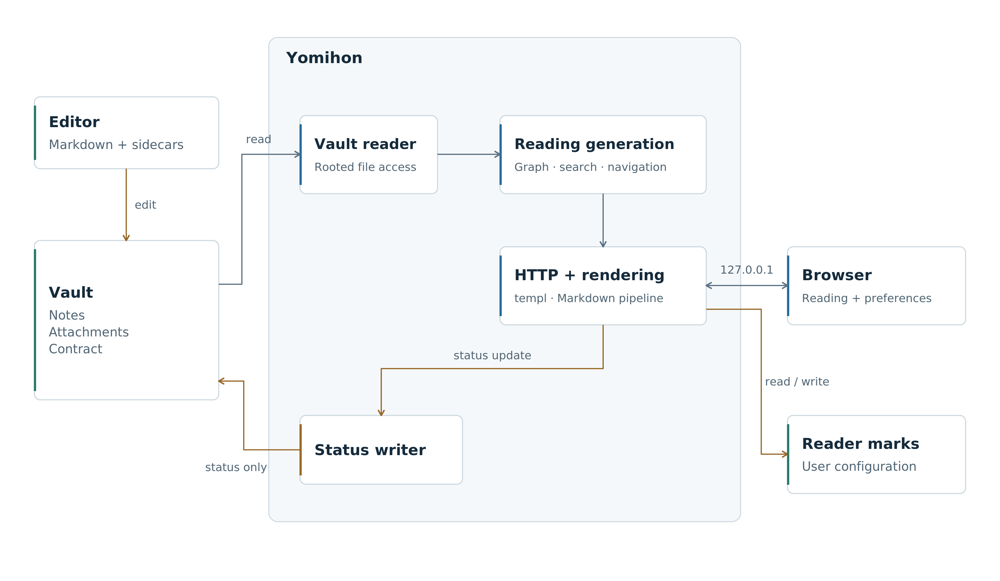
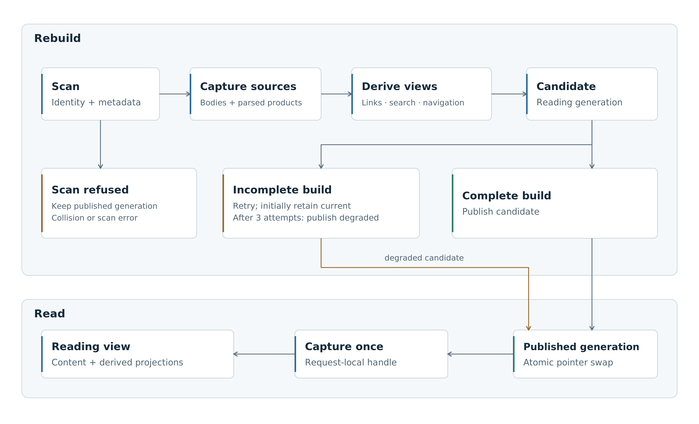
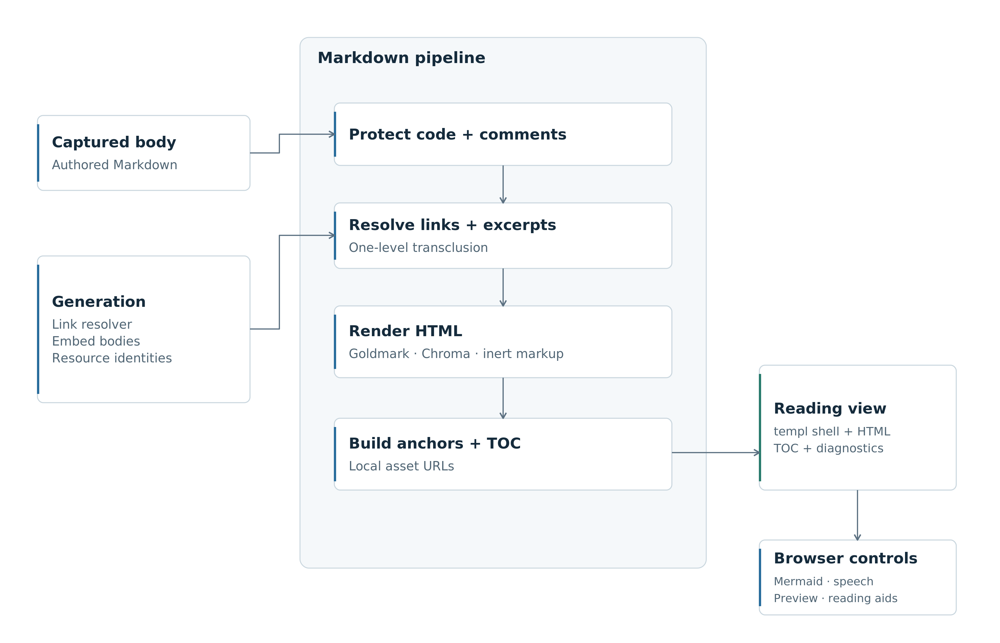
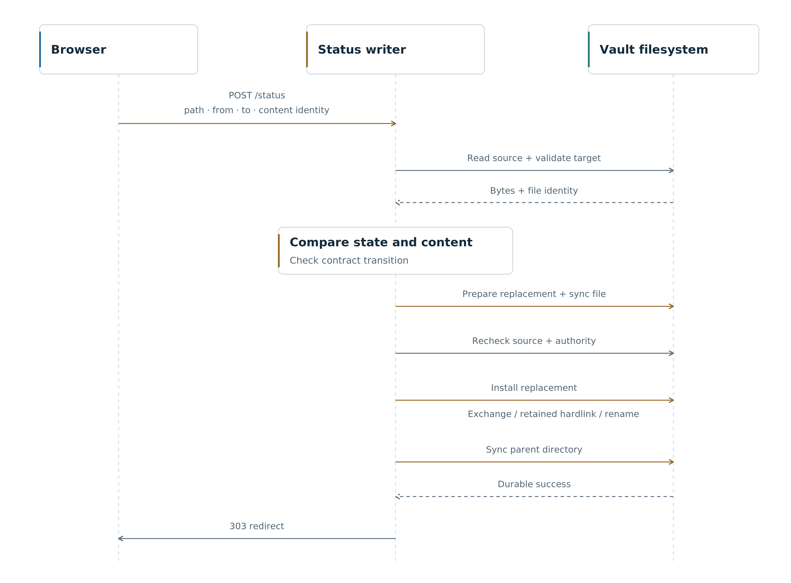
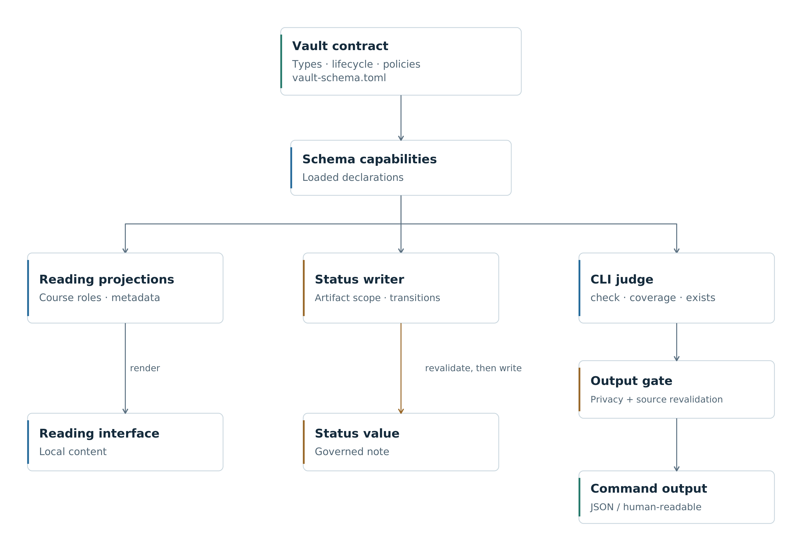

# 架構

[English](ARCHITECTURE.md)

yomihon 將 Markdown 資料夾轉為本機閱讀環境。作者繼續使用自己的編輯器；yomihon 從檔案建立導覽、搜尋、課程與診斷。閱讀標記另外儲存，只有讀者要求合法的 `status` 轉移時，才會修改筆記。

## 1. 閱讀模型

原始檔案是資料依據。衍生視圖可以重建，作者的內容與讀者的個人狀態則分別保存。

| 資料 | 歸屬與生命週期 |
| --- | --- |
| Markdown、frontmatter、附件與練習附檔 | 存放在 vault，由外部工具編輯；合法的狀態修改是例外。 |
| `System/schemas/vault-schema.toml` | 定義筆記類型、欄位、生命週期、導覽角色與輸出政策。 |
| 讀取世代（generation） | 記憶體中的筆記內容、連結解析、導覽、搜尋與診斷，整組替換。 |
| 接續閱讀與疑問標記 | 存放於本機使用者的設定目錄，依 vault 區分。 |
| 外觀與語言偏好 | 存放於瀏覽器 cookie，只影響介面，不改變原文語言與內容。 |

Wikilink 表示引用，`based_on` 宣告來源，學習路徑則安排課程順序。這些關係分別建立視圖：引用一篇筆記不會把它加入課程，閱讀標記也不會改變筆記的生命週期。這些[世代視圖][snapshot]由[應用程式][site]組合。

`cmd/yomihon` 以 `vault.Reader`、`snapshot.Store` 與 `status.Writer` 組合各功能套件。HTTP handler 使用 `templ` 輸出頁面。靜態資源隨 binary 嵌入，原生 JavaScript 模組提供瀏覽器互動，並使用隨附的 Mermaid renderer。執行閱讀介面不需要資料庫或前端資源建置流程。[相依套件][modules]與[資源處理][assets]定義 binary 攜帶的內容。

## 2. Vault 與契約

### 檔案身分

`vault.Reader` 透過 `os.Root` 持有選定目錄。掃描結果包含檔案及父目錄的觀察身分，且只屬於產生它的 reader。後續讀取沿這個受限存取介面解析，不將任意請求路徑直接拼接到目錄名稱。對外的檔案介面只提供讀取、移動讀取位置與關閉，不提供寫入。

內部路徑使用 Unicode NFC，實際開啟時保留檔案系統上的拼寫。Symbolic link 與特殊檔案會略過，隱藏路徑不在掃描範圍內。兩個檔名若正規化為相同路徑，掃描會停止，因為無法替它們建立不同身分。兩篇筆記共用連結別名則是另一種情況：解析器列出所有候選，不會中止整個 vault 的掃描。參見[受限檔案讀取][vault-reader]與[連結解析][graph]。

已開啟的 descriptor 可以在路徑重新命名後繼續指向原檔案，但不會凍結其他程式透過 descriptor 改寫的內容。身分檢查保護的是選中了哪個檔案，不是整個資料夾的交易一致性。

### 契約宣告

`internal/schema` 讀取 TOML 契約，提供導覽、驗證與狀態修改所需的宣告。各功能使用這些宣告，不另外維護筆記類型與狀態清單。Artifact 政策區分可讀材料與受管理的筆記；`scan.knowledge_dirs` 限制生命週期操作，不對瀏覽介面隱藏其他檔案。

| 契約情況 | 閱讀行為 |
| --- | --- |
| 沒有契約 | 一般閱讀、文字搜尋與連結診斷仍可使用；需要契約的操作不可用。 |
| 契約無法載入 | 繼續閱讀並顯示契約異常，關閉狀態寫入。 |
| 契約已載入，但個別政策無效 | 停用受影響的能力，不將缺少有效宣告視為允許。 |
| 載入後契約內容改變 | 撤銷綁定該來源的 artifact 與隱私權限；重新啟動後載入新宣告。 |

契約在啟動時載入，不隨筆記一起熱更新。來源暫時無法讀取時，政策檢查可以只拒絕該次操作；若已觀察到內容改變，舊權限就持續關閉。這避免舊生命週期規則與新政策混用。參見[啟動流程][site]、[artifact 判定][artifact-policy]與[隱私政策][privacy]。

## 3. 讀取世代

掃描器約每兩秒檢查 vault。檔案身分與 metadata 沒有改變時，省略成本較高的重建；週期性的完整重讀則捕捉檔案身分、權限、大小與修改時間都沒改變的編輯。這類編輯可能要等約一小時才會反映。

重建會擷取所需來源內容，解析筆記及共用的解析產物，再建立連結圖、導覽、文字索引、課程索引、反向連結與健康檢查結果。完成後交換 `atomic.Pointer[Generation]`，整組發布。請求只取得一次世代，從中組成閱讀視圖；嵌入其他筆記時，也使用同一世代的內容與解析器，不重新讀取磁碟。參見[世代建構與發布][snapshot]。

這保證各視圖使用同一組內容，不代表檔案系統在某個瞬間的完整快照。檔案仍依序讀取；降級世代也可能刻意保留某個無法讀取來源的舊副本。[Raw 檔案][file-serving]與 [HTML briefing][report] 每次請求仍會重新開啟，不由世代保存所有附件的版本。

### 讀取不完整

| 失敗情境 | 發布行為 |
| --- | --- |
| 首次建構無法讀取部分來源 | 發布可讀部分，標示受阻來源。 |
| 後續重建不完整 | 先保留已發布世代，再嘗試重建。 |
| 自上次完整讀取以來，已有三次不完整嘗試 | 發布可讀來源的更新；無法讀取的來源若有舊副本，就沿用舊副本。 |
| 掃描失敗或發現正規化路徑衝突 | 保留已發布世代，不以無法安全建立的候選取代。 |
| 建構因取消而中止 | 不發布未完成的候選。 |

重試間隔逐步增加，最多一分鐘；metadata 可見的變化能提早觸發重試。三次嘗試後的降級發布，避免單一受損檔案無限期遮住其他新筆記。`Freshness` 在閱讀視圖旁提供受阻來源與上次完整讀取的資訊。

`Generation.Capture` 也會為請求擷取 artifact 權限。另有兩類資訊刻意不固定在不可變的閱讀內容中：freshness 反映掃描器持續嘗試的情況，狀態控制項則觀察筆記在磁碟上的即時狀態。因此狀態修改完成後，不必等下一個閱讀世代發布，控制項就能顯示新狀態。參見[請求組合][site]與[即時狀態讀取][status]。

## 4. 渲染與連結

[渲染流程][render]先保護程式碼與註解，處理 vault 的 Markdown 語法、連結與嵌入，再由 Goldmark 與 Chroma 產生 HTML。接著配置標題錨點、建立目錄並解析本地資源 URL，周圍的閱讀介面由 `templ` 輸出。原文 HTML 只允許不具執行能力的子集：保留 ruby 等閱讀標記，會執行程式或控制導覽的 markup 則顯示為文字。

[連結解析器][graph]識別檔名、不含副檔名的檔名、路徑與 frontmatter aliases，並使用 NFC 與大小寫正規化。Frontmatter 的 `title` 是顯示名稱，不會自動成為連結 key。解析結果分為唯一目標、無目標與多個候選。只符合 title 的情況可以解釋連結為何失敗，但不會暗中替作者修正。章節與區塊片段由渲染層處理，不屬於名稱查找。

筆記嵌入只展開一層。嵌入內容裡的另一個 embed 會成為連結，限制遞迴與循環展開。指定的章節或區塊不存在時，顯示診斷，不擅自改為整篇筆記。多份內容共用一頁時，註腳依區域區分身分；已渲染片段的身分也讓 freshness 檢查能發現被引用內容的變化。

無法解析的 frontmatter、失效連結、缺少媒體與不支援的渲染是不同結果。診斷留在受影響內容旁；語法上色失敗就退回跳脫後的程式碼，不讓整篇筆記消失。Reader 不會為了讓內容通過解析而改寫原檔。

## 5. 搜尋與課程

### 文字搜尋

[`internal/lexical`][lexical] 保留用於顯示的原文與用於比對的正規化副本。查詢在記憶體中的項目上進行確定性的子字串比對與結構化篩選。正規化處理 Unicode、簡單大小寫等價與全形 ASCII，並接合漢字、平假名或片假名之間的折行；它不是詞幹分析、翻譯或語意檢索。

標題、別名、路徑與內文各有搜尋用途。來源對應保留正規化後的命中位置，讓摘要仍可呈現原文；筆記實例的篩選則遵循 artifact 分類。已宣告但無法使用的政策會產生診斷，不以空結果誤導讀者。搜尋 handler 一次擷取索引與導覽。[查詢語法][query]與 [HTTP handler][search] 共用此索引。

預先保存正規化文字，以記憶體換取較少的查詢工作。子字串掃描不需要斷詞器或搜尋服務，多語比對規則也較容易預期；代價是查詢成本仍隨可搜尋內容成長。

### 作者安排的學習路徑

契約指定課程與 lesson 類型；`internal/sequence` 定義分支語法，導覽、課程頁與 CLI 診斷共同使用。

| 分支角色 | 意義 |
| --- | --- |
| `primary` | 依作者順序排列的主線，有自己的課數與前後課導覽。 |
| `local` | 有獨立順序的選讀分支，不併入主線。 |
| `none` | 不納入進度順序的參考資料。 |

明確的角色讓 reader 不必猜測巢狀清單是必讀課程、選讀分支，還是參考資料。練習附檔與概念頁提供作者準備的練習及說明；附檔無法使用時，只停用對應區塊，不讓整個課程失效。瀏覽器可隱藏振假名，並透過 speech synthesis 朗讀指定段落。頁面明確選用瀏覽器回報為本機、符合段落語言與文字系統的語音；沒有符合的語音時，頁面提示無法播放。伺服器沒有模型或語音服務；瀏覽器與作業系統的語音行為，不在 Go 程式的對外請求邊界內。參見[課程編寫][authoring]、[分支語法][sequence]、[課程 handler][syllabus]、[lesson 資料][lesson]與[瀏覽器課程控制][lesson-js]。

## 6. 狀態修改

[`POST /status`][status-handler] 是唯一修改 vault 內容的端點。請求帶入路徑、預期狀態、目標狀態與讀者看過的筆記內容身分。Writer 檢查權限及作用範圍，重讀檔案，比對狀態與內容身分，再依契約驗證轉移。這裡不能將狀態設為 `published`：它代表已在外部完成的發布，yomihon 無法替這件事背書。

[修改][status]只替換狀態值所占的位元組範圍，保留周圍 YAML 語法、註解與正文，並重新解析結果。能讀取但無法以這種方式修改的 YAML 會被拒絕，原文不動，不重新序列化。唯讀、具有 hardlink 或不在契約管理範圍內的目標同樣會被拒絕。

### 寫入安裝

Writer 將自己的操作序列化，在來源旁準備暫存檔，保留必要 metadata、同步替換內容，再次核對來源與政策後才安裝。包含目錄完成同步，才跨過耐久性確認邊界。狀態安裝在受支援的 macOS 與 Linux build 啟用；不支援的平台仍能閱讀，但不提供這項寫入能力。參見[平台支援][durability]與[安裝流程][install]。

檔案系統支援程度決定安裝方式：

| 方式 | 對安裝期間外部編輯的保護 |
| --- | --- |
| Atomic exchange | 保留並檢查被換下的版本，若發現競爭編輯則嘗試復原。 |
| Retained hardlink | 保留原 inode 的另一個名稱，以偵測原地編輯；外部程式同時替換路徑仍可能繞過這層保護。 |
| Plain rename | 替換前重新檢查，但不保護最後的安裝時間窗口。 |

Writer 實際探測檔案系統行為，不只相信操作回傳成功。這些方式不會鎖住外部編輯器，也不提供涵蓋所有外部寫入的 compare-and-swap。

安裝前拒絕會保留原筆記；進入安裝後則要區分結果。無法復原的競爭可能留下兩個版本供檢查；目錄同步失敗，表示新內容已可見，但尚未確認能跨越立即發生的系統故障。耐久寫入成功後，writer 才建立供重新導向頁面使用的短效收據。收據與新狀態都不是經身分驗證的稽核紀錄。參見[安裝結果][install]與[HTTP 處理][status-handler]。

## 7. 閱讀者狀態

接續閱讀與疑問標記保存在 vault 之外的本機使用者設定目錄。它們記錄筆記位置與身分，不寫入作者的進度欄位或正文。解析後的 vault 根路徑決定儲存位置。連到同一個本機 reader 的瀏覽器可以共用標記，外觀與介面語言則各自保存在瀏覽器。

標記檔案在需要時才建立，透過同目錄暫存檔替換，不像筆記更新一樣要求同步到穩定儲存：遺失最近一次閱讀位置是可重新設定的便利功能失敗。沒有設定目錄時停用標記控制項，不妨礙閱讀。損壞的接續紀錄視為沒有保留位置；疑問標記檔案讀取失敗則會顯示給讀者。參見[程式組合][site]、[標記儲存][marks]與[偏好設定][preferences]。

閱讀頁會輪詢 freshness，不把正在顯示的正文當成即時編輯緩衝區。內容身分可辨別筆記是否改變，嵌入內容身分則涵蓋引用片段的變化。因此閱讀、修改狀態與保留位置，各自有不同的新鮮度要求。參見[筆記處理][note]與[片段身分][render]。

## 8. 命令與輸出隱私

[`check`、`coverage` 與 `exists`][commands] 各自開啟 vault，執行獨立的唯讀操作。它們共用解析、連結與契約語意，不呼叫 HTTP server，也不建立閱讀標記。

| 命令 | 回答的問題 |
| --- | --- |
| `check` | Frontmatter、連結、路徑、來源與課程結構的診斷，由指定的 deny 規則決定是否失敗。 |
| `coverage` | 包含概念覆蓋情況的文件庫摘要，只報告，不作為失敗門檻。 |
| `exists` | 可讀且允許輸出的內容中，是否有符合名稱的筆記。 |

指定範圍的 `check` 仍先建立整個根目錄的連結圖，再篩選診斷。輸入不完整不代表不存在：`exists` 可以回報已找到的筆記，但若無法讀取的來源可能改變答案，就拒絕回報不存在；`coverage` 也不會把局部資料當完整統計。存在性結果是一項觀察，不會保留檔名，阻止編輯器隨後建立檔案。[規則清單][judge-rules]列出各項診斷及其依據。

契約中的 [`privacy.never_egress_dirs`][privacy] 控制這些命令的輸出，**不會**對本機閱讀介面隱藏目錄。命令需要有效的契約與隱私宣告，先準備輸出，再驗證來源仍然有效，才交付結果。無法確立依據時，拒絕操作，不將受保護的契約內容引述到輸出通道。[命令邊界][adjudicate]區分結果內容與工具失敗。

機器格式中，`check` 使用 JSON Lines，`coverage` 與 `exists` 使用 JSON；終端機預設顯示人讀格式。Exit `1` 代表命中指定門檻或查無筆記，`2` 代表呼叫方式錯誤或工具失敗。沒有符合的 deny 政策時，出現診斷本身不等於 exit `1`。Golden fixtures 固定輸出欄位與原因字串，供呼叫端依賴。外部 agent 可以使用這些命令，再透過自己的工具編輯；yomihon 不執行模型，也不自動修復它們產生的內容。

## 9. 瀏覽器邊界

HTTP listener 綁定 `127.0.0.1`，`YOMIHON_PORT` 只改變連接埠。Host 檢查拒絕非 loopback 名稱，origin protection 保護表單提交。回應政策在最後送出 header 時套用，包含錯誤與串流路徑；CSP、同源資源政策及受限的瀏覽器權限共同約束閱讀介面。參見[啟動][main]與[origin 政策][origin]。

HTML briefing 使用獨立的 sandbox 回應，禁用腳本、連線、表單與巢狀 frame，允許 inline style 及以 data 內嵌的資源。政策同時附在 raw response 與外層 iframe，直接開啟 raw URL 也不會移除限制。一般檔案則經受限的根目錄選取與對應的 raw-file 政策提供。參見[briefing 處理][report]與[檔案服務][file-serving]。

Loopback 與瀏覽器來源保護不會驗證本機操作者的身分。透過公開 reverse proxy 暴露這個程式，需要另一套存取與隔離設計。同樣地，CLI 輸出隱私是應用程式邊界，不是限制其他程式讀取 vault 的作業系統權限。

## 10. 資源與驗證

主要工作負載是讀者機器上持續變動的文件庫：啟動時間、編輯後可見延遲、搜尋延遲，以及新舊世代共存時的記憶體。

| 壓力來源 | 量測內容 | 成本值得處理時可評估的方向 |
| --- | --- | --- |
| 反覆掃描目錄 | 檔案數、目錄深度、閒置 I/O、掃描時間。 | 以檔案事件作為提示，仍保留 reconciliation 捕捉漏失事件。 |
| 完整重建 | 來源總位元組、解析時間、衍生索引配置量、密集編輯。 | 重用未變更的解析結果，不分批發布彼此不一致的視圖。 |
| 世代重疊 | 重建與長請求期間的 live heap、舊世代回收。 | 減少重複表示或昂貴的世代資料。 |
| 子字串搜尋 | 文件庫大小、長查詢、常見詞、篩選與摘要成本。 | 引入候選索引，但保留既有比對與摘要語意。 |
| 豐富筆記渲染 | Code fence、語法上色、嵌入、表格與瀏覽器 Mermaid 工作。 | 限制昂貴工作；快取 key 必須涵蓋內容及其相依來源身分。 |
| 狀態安裝 | 來源重讀、屬性檢查、writer 競爭、檔案系統同步。 | 縮小臨界區，不以作者的原始內容換取更快確認。 |

資料庫或持久化索引會在可由外部編輯的檔案之外，增加失效與恢復協定。只有量測到的重建或查詢成本足以抵銷這份責任時，才值得引入。File watcher 本身也無法取代對漏失事件、重新命名、權限與身分變化的重新核對。

測試對應這些邊界：真實檔案系統與權限 fixture、並發 snapshot 讀取、渲染及查詢案例、安裝窗口故障、固定的命令輸出與瀏覽器行為。架構檢查限制哪些套件可以寫 vault 或解讀契約詞彙；範圍由檢查實作決定，不是任意程式碼的執行沙箱。參見[架構檢查][archlock]、[snapshot 測試][snapshot-package]、[狀態測試][status-package]、[搜尋測試][lexical-package]與[貢獻檢查][contributing]。

可執行的端到端驗證包括：

| 實驗 | 需要觀察的結果 |
| --- | --- |
| 載入頁面時同時編輯筆記與其嵌入來源 | 每個閱讀視圖使用已發布世代，freshness 識別內容變化。 |
| 讓來源無法讀取，新增另一篇筆記，再恢復權限 | 保留、降級發布與恢復依序發生，受阻來源可見。 |
| 製造 NFC 檔名衝突與重複 alias | 掃描拒絕與連結歧義仍是不同診斷。 |
| 在不同檔案系統上讓編輯器與狀態寫入競爭 | 安裝策略與結果正確描述保留、已可見或未確認的內容。 |
| 命令執行中修改契約 | 來源依據不再有效時，不交付輸出。 |
| 載入惡意 Markdown 或 HTML briefing | 原文不能取得閱讀應用的腳本或表單權限。 |
| 增加文件庫大小，交錯編輯與查詢 | 量測建構時間、可見延遲、搜尋延遲分布與記憶體峰值，不只計算筆記數量。 |

關閉時先停止接收請求與掃描，等待已接受的 handler 完成，再釋放受限的 reader 與 writer。即使 HTTP shutdown 已到期限，也優先完成已開始的檔案安裝。參見[程式生命週期][site]。

[site]: cmd/yomihon/site.go
[main]: cmd/yomihon/main.go
[modules]: go.mod
[assets]: internal/asset
[vault-reader]: internal/vault/reader.go
[snapshot]: internal/snapshot/snapshot.go
[snapshot-package]: internal/snapshot
[artifact-policy]: internal/schema/instance.go
[privacy]: internal/schema/privacy.go
[graph]: internal/graph/graph.go
[render]: internal/render/render.go
[lexical]: internal/lexical/lexical.go
[lexical-package]: internal/lexical
[query]: internal/lexical/query.go
[search]: internal/search
[sequence]: internal/sequence/sequence.go
[syllabus]: internal/syllabus
[lesson]: internal/lesson
[lesson-js]: assets/js/lesson.js
[authoring]: docs/authoring.md
[status]: internal/status/status.go
[status-package]: internal/status
[status-handler]: internal/status
[install]: internal/status/install.go
[durability]: internal/status/durability_supported.go
[marks]: internal/mark/file.go
[preferences]: internal/preference
[note]: internal/note/handler.go
[commands]: internal/judge/command.go
[adjudicate]: cmd/yomihon/adjudicate.go
[judge-rules]: docs/judge-rules.md
[origin]: internal/origin/origin.go
[report]: internal/report/handler.go
[file-serving]: internal/note/file.go
[archlock]: internal/archlock
[contributing]: CONTRIBUTING.md
