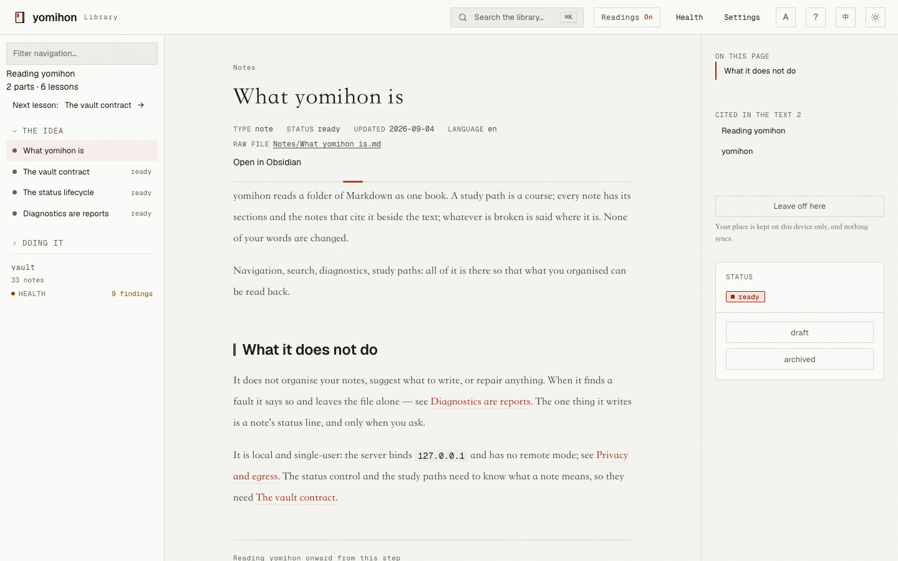

<h1> yomihon</h1>

English | [繁體中文](README.zh-TW.md)

[](https://github.com/koopa0/yomihon/actions/workflows/ci.yml)
[](LICENSE)

**Turn the Markdown you have already organised into a book worth reading.**

[](.github/media/reading-en.png)

yomihon reads a folder of Markdown as one book. A study path is a course, with
chapters and the lesson you are on; every note has its sections and the notes
that cite it beside the text; whatever is broken is said where it is. It runs
on your machine and changes none of your words.

## Install

```sh
go install github.com/koopa0/yomihon/cmd/yomihon@latest
```

Needs Go 1.27 or newer.

## Use

```sh
yomihon ~/notes
```

Then open <http://127.0.0.1:9610>. Any folder works as it is;
`yomihon examples/vault` opens an example vault with a contract, and shows what
a contract adds.

## What it does

- **Read.** Wikilinks, callouts, footnotes, tables, Mermaid, code and ruby
  render as written. The page is set for long-form reading, Chinese and
  Japanese first, with a light and a dark desk and three text sizes.
- **Learn.** A study path is a course: chapter counts, previous and next, and
  the lesson you are on. Furigana switches on and off; a passage marked for
  reading aloud is spoken in its own language. The example vault carries
  [a study path to copy](examples/vault/Notes/Reading%20yomihon.md).
- **Find.** Full-text search with folder filters; backlinks and the note's own
  sections stay beside the text.
- **Check.** A health page lists links with no target, notes nothing cites, and
  one name two files answer to; each note carries its own diagnostics; on the
  command line it is `yomihon check`. It reports and repairs nothing.
- **Reports.** Briefings kept under `System/reports/daily-briefing/` open in
  the same room, sandboxed.
- **Two languages.** The interface speaks English or Traditional Chinese; every
  note keeps the language it was written in.
- **Yours.** It binds to `127.0.0.1` only, makes no network call, and never
  edits your prose.

## Status

Under development; expect the interface to change before the first stable
release. Defects go to [Issues](https://github.com/koopa0/yomihon/issues),
security problems to
[GitHub's private advisory form](https://github.com/koopa0/yomihon/security/advisories/new).

## Licence

[MIT](LICENSE).
