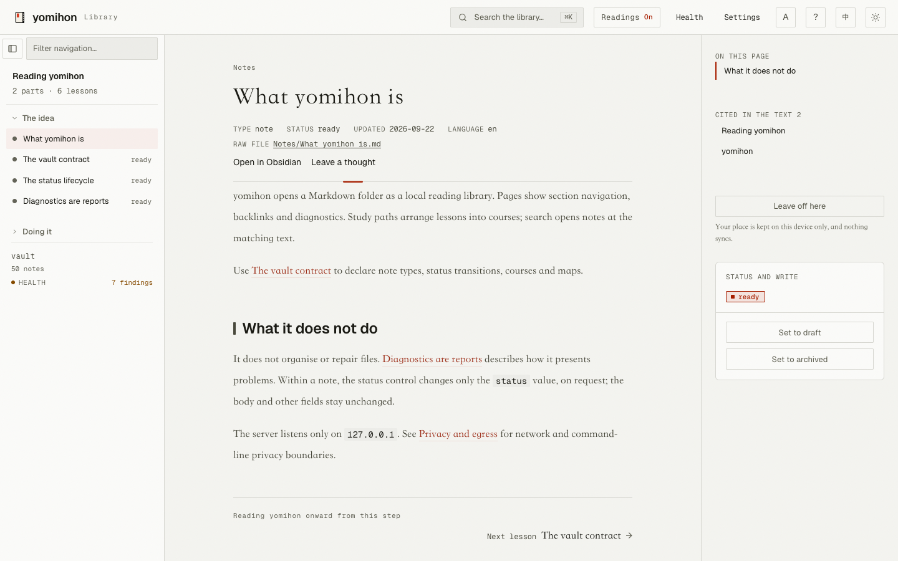

<h1> yomihon</h1>

English | [繁體中文](README.zh-TW.md)

[](https://github.com/koopa0/yomihon/actions/workflows/ci.yml)
[](go.mod)
[](LICENSE)

**yomihon turns the Markdown you have already organised into a book that reads well.**

[](.github/media/reading-en.png)

A study path is a course, with its parts and the lesson you are on. Search, backlinks and reports are built in. yomihon runs on your machine, makes no network requests and never edits your text.

## Try it

[yomihon.koopa0.dev](https://yomihon.koopa0.dev) runs the [example library](examples/README.md) from this repository. Visitors share one copy of the notes. It is restored every hour.

## Install

[Download a binary](https://github.com/koopa0/yomihon/releases/latest) from the latest release, or install with Go 1.27 or newer:

```sh
go install github.com/koopa0/yomihon/cmd/yomihon@latest
```

yomihon runs on macOS, Linux and Windows. The example library comes with the source, not the binary. Take it from the release's source archive or clone this repository.

## Use

```sh
yomihon ~/notes
```

Then open <http://127.0.0.1:9610>. yomihon reads any folder of Markdown as it is. Study paths, maps and `yomihon check` need a contract, `System/schemas/vault-schema.toml`. `yomihon examples/vault` opens a library that has one to copy. If an agent writes your notes, point it at [`skills/`](skills/) first.

To turn your notes into a course, follow [Make a course](docs/authoring.md). It covers the starter contract, lesson files, the main line and an optional side branch.

## What it does

- **Read.** Wikilinks, callouts, footnotes, tables, Mermaid diagrams, code and ruby render as written. Settings offer light, dark or the system's appearance, three text sizes, and serif, sans serif or Kaiti type. "Leave off here" keeps your place on this device. The home page links back to it.
- **Learn.** A course lists its parts, marks the lesson you are on and links the lessons before and after it. A side branch is optional reading. Furigana can be hidden. A Japanese passage the author marks in a lesson can be read aloud. The example library has [a Go concurrency course](examples/vault/Notes/Books/Go%20並行入門.md) and [two Japanese dialogue lessons](examples/vault/Notes/Books/在圖書館讀日文.md).
- **Find.** Search works in English, Chinese and Japanese. A note shows its sections and the notes that cite it beside the text. A map lists the notes under one subject.
- **Reports.** Daily briefings (HTML) and written reports (Markdown) under `System/reports/` are listed together. A briefing opens in a sandbox.
- **Check.** The health page lists wikilinks that point at nothing and notes no other note links to. `yomihon check` lists broken links and frontmatter problems in a terminal.

The interface is available in English and Traditional Chinese. A note keeps the language it was written in.

## Status

Under development; expect the interface to change before the first stable release. Defects go to [Issues](https://github.com/koopa0/yomihon/issues), security problems to [GitHub's private advisory form](https://github.com/koopa0/yomihon/security/advisories/new).

## Licence

yomihon is released under the [MIT licence](LICENSE).
