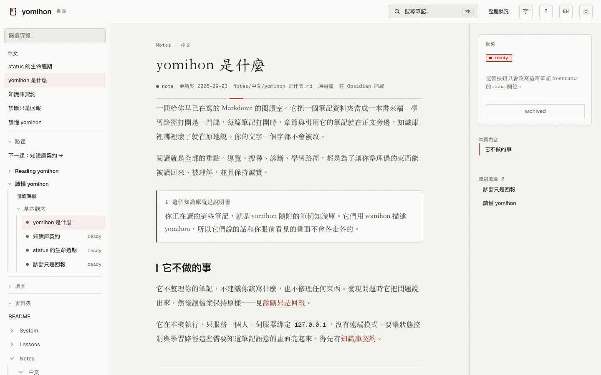

<h1> yomihon</h1>

[English](README.md) | 繁體中文

[](https://github.com/koopa0/yomihon/actions/workflows/ci.yml)
[](LICENSE)

**把你整理好的 Markdown，變成一本好讀的書。**

[](.github/media/reading-zh-TW.png)

筆記在資料夾裡累積；理解發生在把它們讀回來的時候。yomihon 把一個 Markdown 資料夾當成一本書來端：學習路徑打開是一門課，有章節、有你讀到哪；一篇筆記打開時，章節與引用它的筆記就在正文旁邊；知識庫裡哪裡壞了，就在壞掉的地方說。它在你的機器上執行，筆記在哪裡就在哪裡讀。

## 安裝

```sh
go install github.com/koopa0/yomihon/cmd/yomihon@latest
```

需要 Go 1.27 以上版本。

## 使用

```sh
yomihon serve ~/notes
```

接著開啟 <http://127.0.0.1:9610>。任何資料夾都能照原樣讀；`yomihon serve examples/vault` 可以看見加上知識庫契約之後多了什麼。

## 它做什麼

- **讀。** wikilink、callout、註腳、表格、Mermaid、有語法標示的程式碼與 ruby，都照作者的意思呈現。版面為長篇閱讀而設，中日文優先，有亮與暗兩種桌面、三段字級。
- **學。** 學習路徑變成課程：課數、上一課與下一課、你在哪裡。振假名可開可關；標了朗讀的段落用它自己的語言唸出來（[怎麼寫一條學習路徑](AUTHORING.md)）。
- **找。** 關鍵字搜尋，可按資料夾篩選，零筆時給你退一步的建議；反向連結與本頁章節留在正文旁邊。
- **讓知識庫誠實。** 一頁健康狀況列出連不到目標的連結、沒有人引用的筆記、兩個檔案同時應答的名字；每篇筆記帶著自己的診斷；同一套檢查在命令列是 `yomihon check`。它不替你修任何東西——檔案由你改。
- **報告。** 放在知識庫裡的 HTML 報告，在同一間閱讀室裡打開，隔離執行。
- **兩種語言。** 介面說英文或繁體中文；每篇筆記保留書寫時使用的語言。
- **你的。** 只綁 `127.0.0.1`，永遠不發網路請求，也不動你的文字。

## 目前狀態

仍在積極開發中；第一個穩定版本推出前，產品與介面仍可能有明顯變動。缺陷請開 [Issues](https://github.com/koopa0/yomihon/issues)，安全性問題請走
[GitHub 私密漏洞回報](https://github.com/koopa0/yomihon/security/advisories/new)。

## 授權

採用 [MIT](LICENSE)。重新散布的字型與前端資產列於
[`THIRD_PARTY_NOTICES.md`](THIRD_PARTY_NOTICES.md)。
