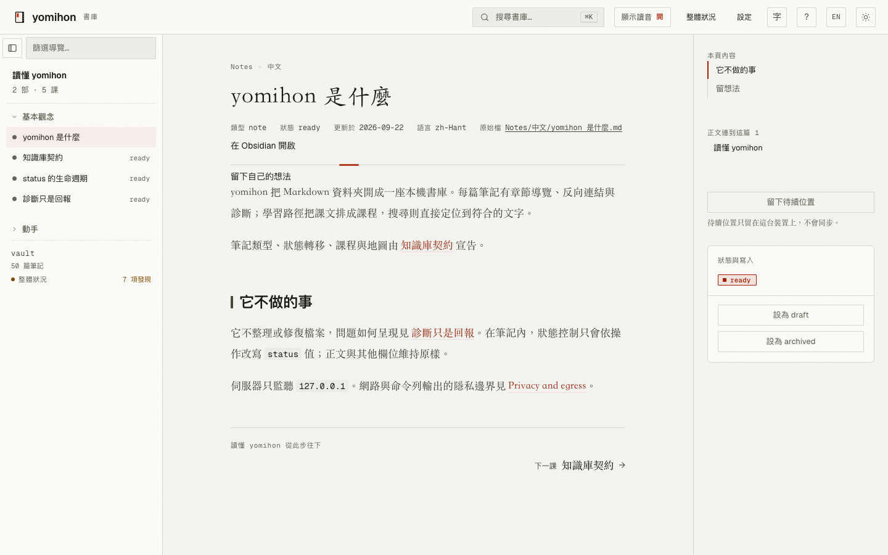

<h1> yomihon</h1>

[English](README.md) | 繁體中文

[](https://github.com/koopa0/yomihon/actions/workflows/ci.yml)
[](go.mod)
[](LICENSE)

**yomihon 把你整理好的 Markdown，變成好讀的讀本。**

[](.github/media/reading-zh-TW.png)

學習路徑就是一門課，分成幾部，也標出你讀到哪一課。搜尋、反向連結與報告一併附上。yomihon 在你的機器上執行，不發任何網路請求，也不改你的文字。

## 線上試讀

[yomihon.koopa0.dev](https://yomihon.koopa0.dev) 開著本 repo 的[範例知識庫](examples/README.zh-TW.md)。所有訪客共用同一份筆記。每小時還原一次。

## 安裝

從最新版本[下載執行檔](https://github.com/koopa0/yomihon/releases/latest)，或在已有 Go 1.27 以上時安裝：

```sh
go install github.com/koopa0/yomihon/cmd/yomihon@latest
```

yomihon 可在 macOS、Linux 與 Windows 上執行。範例知識庫附在原始碼裡，不在執行檔中。請從該版本的原始碼壓縮檔取得，或 clone 本 repo。

## 使用

```sh
yomihon ~/notes
```

接著開啟 <http://127.0.0.1:9610>。任何 Markdown 資料夾都能直接讀。學習路徑、地圖與 `yomihon check` 需要契約 `System/schemas/vault-schema.toml`。`yomihon examples/vault` 開啟的知識庫附有一份，可以照著改。如果由 agent 替你寫筆記，請先讓它讀 [`skills/`](skills/)。

## 它做什麼

- **讀。** wikilink、callout、註腳、表格、Mermaid 圖、程式碼與 ruby，照作者寫的呈現。設定頁可選亮色、暗色或跟隨系統，三段字級，明體、黑體或楷體。「留下待續位置」把你讀到的地方記在這台裝置上。首頁會列出這個位置，點一下就能回去。
- **學。** 學習路徑是一門課：分成幾部，標出你讀到的這一課，列出前後各一課，還有選讀的支線。振假名可以隱藏。課文裡作者標了朗讀的日文段落，可以唸出來。範例知識庫有一門[《Go 並行入門》](examples/vault/Notes/Books/Go%20並行入門.md)，另有[兩課日文短對話](examples/vault/Notes/Books/在圖書館讀日文.md)。
- **找。** 搜尋支援中文、日文與英文。每篇筆記旁邊放著本頁章節與引用它的筆記。地圖列出同一主題底下的筆記。
- **報告。** 放在 `System/reports/` 的每日簡報（HTML）與文字報告（Markdown）列在一起。簡報在沙盒裡開啟。
- **檢查。** 整體狀況頁列出指向不存在目標的 wikilink，以及沒有其他筆記連過來的筆記。有契約時，`yomihon check` 在終端機列出失效連結與 frontmatter 問題。

介面有英文與繁體中文。筆記保留寫下時的語言。

## 目前狀態

開發中；第一個穩定版之前，介面還會變。缺陷請開 [Issues](https://github.com/koopa0/yomihon/issues)，安全性問題請走 [GitHub 私密漏洞回報](https://github.com/koopa0/yomihon/security/advisories/new)。

## 授權

yomihon 以 [MIT](LICENSE) 授權釋出。
