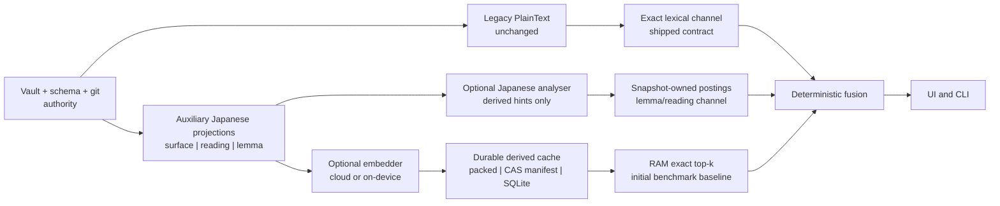

# Japanese analysis, search, and derived-storage recommendation

> Status: research recommendation, not product canon or an approved
> implementation plan
>
> Date: 2026-07-11
>
> Scope: recommendations after excluding Badger and Ristretto

## Executive decision

The best current shape is not one database or one search library. It is a set
of deliberately separate layers:

1. Preserve the shipped deterministic substring search as the exact lexical
   contract.
2. Add an explicitly auxiliary Japanese projection before adopting a tokenizer:
   keep orthographic surface, ruby reading, and derived lemma as distinct
   fields while leaving the shipped `PlainText` lexical channel unchanged.
3. Run a bounded direct-Kagome evaluation. Do not adopt Kagome, an IPA or
   UniDic dictionary, or generated readings until a human-labelled yomihon
   fixture proves the relevant behaviour.
4. Do not adopt `ikawaha/bleveplugin` now. It is an integration for projects
   that have independently chosen Bleve, not a reason to choose Bleve.
5. If the hybrid-search draft keeps incremental changed-chunk writes,
   concurrent server-writer/CLI-reader access, and atomic epoch cutover, plain
   SQLite rows and float32 BLOBs are the leading durable-cache candidate, not a
   logical inevitability. Benchmark them against content-addressed vector blobs
   plus an atomically replaced immutable epoch manifest.
6. If persistence is reduced to occasional whole-corpus checkpoints, include a
   packed immutable binary generation in that comparison. SQLite is not
   automatically required merely because vectors exist.
7. Do not adopt sqlite-vec or pgvector now. Re-evaluate the query engine from
   measured latency, memory, recall, concurrency, and deployment needs. A
   chunk count is not an engine-selection rule by itself.
8. Do not implement against `gemini-embedding-001`. Google lists its shutdown
   for 2026-07-14. If a cloud track is authorized, a Gemini spike must target
   `gemini-embedding-2`. An on-device multilingual track is equally mandatory
   if query egress remains forbidden. Model, dimension, prompt format,
   normalization, runtime, and chunker version must be part of the epoch.

This report treats repository evidence as falsifiable context. Existing
decisions explain the current system, but they do not win against a better
measured design.

## What is being optimized

yomihon is currently a local, single-user reader and human review terminal for
a contract-bearing Markdown vault. The vault, schema, and git history remain
authority; every index discussed here is derived and disposable
(`CLAUDE.md`, `docs/product.md:11-37`, `internal/search/search.go:1-8`). The
current working vault is small enough that a server process can hold complete
read models in memory (`docs/vault-model.md:85-89`).

The proposed tools must therefore earn their cost against these properties:

- exact and explainable behaviour for the existing lexical search;
- unusually strong Japanese-learning value for the owner;
- no silent rewrite of authored ruby, lesson text, metadata, or status;
- local-first operation and explicit egress boundaries;
- a no-daemon, low-friction open-source installation by default;
- deterministic degradation when an optional analyser, embedding provider, or
  cache is unavailable;
- release artefacts that satisfy third-party licence and notice obligations.

The target is not “use Japanese NLP” or “use a vector database.” The target is
better reading and retrieval without making correctness, privacy, deployment,
or maintenance less honest.

## Evidence and limits

### Sources inspected

- The current repository contracts, search implementation, renderer plain-text
  extraction, product description, roadmap, and uncommitted hybrid-search
  draft.
- Upstream source, releases, module graphs, CI, and licence/notice files for
  Kagome, kagome-dict, bleveplugin, and related `ikawaha` repositories.
- Official SQLite, sqlite-vec, SQLite Vec1, pgvector, and Gemini documentation
  current on 2026-07-11.
- A local spike over the actual L01-L20 lesson files. No result below is
  inferred solely from an upstream README example.

### Local test environment

- Go 1.26.5, Darwin arm64, Apple M1.
- 20 lesson documents: `Writing/lessons/japanese/L01` through `L20`.
- The live vault contained 458 Markdown files, 5,029,831 bytes, and 6,903
  Markdown headings when measured. This is a local observation, not a public
  fixture or a replacement for `docs/vault-model.md`.
- Morphology corpus lines were selected with a simple “at least three kana”
  heuristic after producing an orthographic projection. The reported unknown
  rate is therefore a diagnostic, not an accuracy score: Chinese explanation,
  names, Markdown remnants, and domain terms still occur.
- The projection spike used a deliberately narrow recognizer for the authored
  `<ruby>base<rt>reading</rt></ruby>` form present in these lessons. A product
  implementation must work from the renderer's parsed structure and test raw
  HTML, malformed markup, and fences; the disposable spike is not reusable
  parser code.
- The spike harness and downloaded modules were disposable and are not part of
  this repository. Any adoption PR must commit a sanitised fixture and a
  repeatable evaluator rather than treating this report's numbers as a
  permanent benchmark.
- Timing and resident-memory numbers are exploratory smoke results, not
  `benchstat` performance claims. They are sufficient to expose order-of-
  magnitude integration cost; production selection still requires controlled
  repeated benchmarks on supported targets.

## Architecture: keep five concerns separate



This split prevents four category errors:

- a tokenizer is not a full-text search engine;
- a durable cache is not a vector query engine;
- a vector query engine is not the vault's source of truth;
- an embedding provider is not the retrieval architecture.

## Japanese text must be projected before it is analysed

The current `render.PlainText` intentionally includes both the base text and
the `<rt>` text of authored ruby (`internal/render/plaintext.go:27-42`). That is
useful for broad discoverability, but concatenation is not a valid Japanese
sentence for either contiguous orthographic matching or morphological
analysis.

One real L20 case demonstrated the problem:

| Projection probe | Current combined plain text | Orthographic projection |
|---|---:|---:|
| `本を 読む` | no match | match |

The authored source has ruby around the kanji and particles. Combining base
and reading can create forms such as `本ほんをお 読よむ`, so the contiguous
orthographic string disappears even though the rendered sentence visibly
contains it. This disposable probe compared projected strings; it did not run
the shipped query parser, which whitespace-splits bare terms and AND-matches
substrings. A product test must exercise `internal/search` end to end.

The prerequisite design is three explicit projections:

| Projection | Source | Contract |
|---|---|---|
| `surface_text` | body with ruby base retained and `<rt>` excluded | authored orthography for an auxiliary Japanese channel |
| `reading_text` | surrounding visible kana with each ruby base replaced by its authored `<rt>` reading, under a documented hiragana/katakana normalization | author-provided reading lookup |
| `lemma_terms` | optional analyser output | derived expansion; never replaces either field |

Authored ruby wins over every generated reading. Generated data may add a
candidate or search expansion, but must never rewrite the vault or be presented
as authoritative pronunciation. Dictionary version and any user dictionary
must be included in the derived-index epoch.

These projections are additive candidates, not a silent lexical-v2 migration.
The legacy combined `PlainText` index remains byte-for-byte frozen. Disabling
the Japanese channel must reproduce its hits, ordering, and snippets. If a
future decision replaces `PlainText`, that is an explicit lexical-v2 contract
with new goldens rather than an implementation detail. The additive projection
is still valuable even if Kagome is ultimately rejected.

## Kagome: worthy of a direct spike, not unconditional adoption

### What it can plausibly add

Direct Kagome can provide locally, without a daemon or content egress:

- Japanese word boundaries;
- part-of-speech labels;
- inflection base forms, such as `行っ` to `行く`;
- dictionary readings or pronunciations;
- a user dictionary for recurring vault-specific terms.

That makes it a plausible implementation component for two optional features:

1. a lemma-aware secondary lexical channel, where a query for `行く` can find
   inflected forms; and
2. study assistance that exposes a derived token, lemma, or reading for human
   inspection.

It does not by itself provide pedagogical grammar explanations, reliable
automatic furigana, semantic search, or a relevance model. Those are separate
product claims.

### The smallest lemma-search engine to evaluate

Rejecting Bleve does not mean sending tokenizer output directly to fusion. The
first candidate should be snapshot-owned in-memory postings:

```text
lemma or authored reading -> sorted note/chunk identifiers
```

Rebuild those postings with the existing immutable vault snapshot. Analyse the
query only for this auxiliary channel; never rewrite the legacy lexical query.
Compare two explicit semantics in the relevance fixture:

1. a separate lemma/reading result list fused as a named channel; and
2. controlled query expansion inside an auxiliary scan.

The first is the recommended baseline because each broader hit can say
“matched lemma `行く`” or “matched authored reading `せんせい`,” and turning the
analyser off removes the channel cleanly. Start with all query lemmas required,
deterministic field buckets and rel-path tie-breaking, no unconditional stop
list, and no persistent postings at this scale. Ranking, surface-versus-reading
weights, and RRF participation remain evaluation outcomes. Kagome supplies
tokens; this postings/query contract supplies search.

### Upstream health

The tested release was [Kagome v2.11.0](https://github.com/ikawaha/kagome/releases/tag/v2.11.0),
released 2026-03-03. The project is active, written in pure Go, tests multiple
platforms, and embeds its dictionaries for self-contained deployment. Kagome's
code is MIT-licensed. The direct dependency is technically credible. The spike
used kagome-dict v1.1.7 and the IPA/Uni modules at v1.2.6.

The dictionaries are the harder decision:

| Candidate | Upstream data | Strength observed | Cost or risk observed |
|---|---|---|---|
| IPA | MeCab IPADIC 2.7.0 (2007) | compact; `Token.Reading()` works; correct base forms in common lesson verbs | older vocabulary; ambiguous compounds; higher unknown proxy in this corpus |
| Uni | UniDic MeCab 2.1.2 (2013) | richer linguistic fields; lower unknown proxy; correctly kept some compounds together | much larger memory/binary; generic `Token.Reading()` is undefined; needs dictionary-specific pronunciation extraction |

Neither dictionary's age makes it automatically wrong for beginner lesson
Japanese, but neither is current enough to trust without yomihon-specific
measurement.

### Behaviour found on real lesson terms

Both dictionaries correctly reduced common inflections:

| Input | IPA | Uni |
|---|---|---|
| `行った` | `行っ → 行く`, `た` | `行っ → 行く`, `た` |
| `行かなかった` | `行か → 行く`, `なかっ → ない`, `た` | same base-form sequence |
| `食べました` | `食べ → 食べる`, `まし → ます`, `た` | same base-form sequence |
| `読みませんでした` | `読み → 読む`, auxiliaries | same main-verb lemma, with a different negative-auxiliary lemma |

The spike also found behaviour that forbids automatic trust:

- IPA analysed `振り仮名` as `振り / フリ` plus `仮名 / カメイ`.
  `カメイ` is the wrong reading in this context.
- Uni kept `振り仮名` as one token and exposed pronunciation `フリガナ`, but
  the generic `Token.Reading()` API returned no value. The Uni dictionary build
  explicitly leaves `ReadingIndex` undefined and exposes pronunciation through
  another field.
- IPA treated `AI`, `RAG`, and `yomihon` as unknown tokens in the tested forms.
  Uni handled Latin characters differently but still treated `yomihon` as
  unknown.
- A user dictionary can address recurring product terms, but it becomes a
  versioned, tested, maintained product artefact rather than a free fix.

### Corpus diagnostics

| Dictionary | Japanese-bearing tokens | Unknown proxy | Base-form coverage | Generic reading coverage |
|---|---:|---:|---:|---:|
| IPA | 30,987 | 12.47% | 87.53% | 87.53% |
| Uni | 30,359 | 8.06% | 91.94% | 0.00% |

The Uni reading value is an API-shape finding, not proof that Uni lacks reading
data. Its features include lemma reading and pronunciation; yomihon would need
an explicit Uni pronunciation reader and corresponding tests. Likewise, a lower unknown
rate is not proof of more accurate segmentation or readings.

### Integration footprint

Stripped test binaries and one launch of each binary produced:

| Binary | Size | Maximum RSS | Go packages in build graph |
|---|---:|---:|---:|
| empty baseline | 1.16 MB | 3.2 MB | 29 |
| Kagome + IPA | 14.28 MB | 152.0 MB | 81 |
| Kagome + Uni | 48.36 MB | 613.4 MB | 81 |
| bleveplugin + Bleve, IPA selected | 72.13 MB | 163.5 MB | 316 |

Across two exploratory runs, IPA initialization was about 0.43-0.69 seconds
and analysis of the selected L01-L20 corpus took about 33-43 milliseconds.
Uni initialization was about 1.51-2.45 seconds and analysis took about 40-85
milliseconds. These measurements are hardware-specific and not comparative
benchmark claims, but the Uni resident-memory cost is large enough to require
an explicit product budget.

### Kagome verdict

**Conditional spike: yes. Production adoption: not yet.**

Start with IPA as the deployment-cost baseline and Uni as the accuracy
challenger. Do not choose either from unknown rate alone. The selection fixture
must include at least:

- lesson conjugations and auxiliaries from L04 and L14-L20;
- authored ruby and ambiguous readings;
- names, katakana loanwords, counters, dates, and particles;
- product and technical terms such as `言の葉`, `yomihon`, `RAG`, and `AI`;
- exact expected token boundaries, lemmas, and readings reviewed by a human;
- search relevance labels for surface, kana-reading, and lemma queries.

Measure boundary F1, lemma accuracy, reading accuracy, search recall@5/MRR,
binary size, peak RSS, initialization time, and indexing time. The acceptance
threshold must be attached to a concrete feature. Automatic furigana requires
a much higher correctness bar than a visibly labelled optional search
expansion.

## Why bleveplugin is not the right adoption unit

The tested release was
[bleveplugin v0.0.13](https://github.com/ikawaha/bleveplugin/releases/tag/v0.0.13),
released 2026-06-27. It is active and its Apache-2.0 licence is compatible with
an MIT application when redistribution conditions are met. That does not make
Bleve the right search engine for yomihon.

The plugin makes several consequential choices:

- it imports Bleve and both IPA and Uni dictionary packages;
- it fixes Kagome's segmentation to search mode;
- its README example enables base-form replacement, part-of-speech stop tags,
  and Japanese stop words;
- the stop lists remove particles and auxiliaries that are meaningful search
  targets in a beginner Japanese knowledge base;
- it substitutes lemma terms; it does not emit an additional authored-reading
  synonym field.

Observed L01-L20 behaviour demonstrates the semantic change:

| Query/configuration | Hits | Literal comparison |
|---|---:|---:|
| `は`, upstream stop configuration | 0 | 20 documents contain the literal |
| `を`, upstream stop configuration | 0 | 20 documents contain the literal |
| `行った`, upstream stop configuration, AND | 12 | literal appears in 2 documents |
| `行った`, keep auxiliaries, AND | 7 | literal appears in 2 documents |
| `行かなかった`, keep auxiliaries, AND | 2 | literal appears in 1 document |
| `普通形`, keep terms, AND | 2 | literal appears in 1 document |

Some broader matches may be relevant; that is exactly why they require a
labelled relevance fixture. They cannot silently replace literal semantics.
Bleve's default match operator also broadened several test queries further,
showing that copying the upstream example is not a yomihon design.

**Verdict: do not adopt bleveplugin now.** First decide whether a direct Kagome
derived field wins its feature-specific evaluation. Only evaluate
bleveplugin if Bleve later wins an independent full-text-engine decision. The
dependency graph and binary cost then belong to that decision, not to “Japanese
support.”

## Other ikawaha projects

| Project | Finding | Decision |
|---|---|---|
| `sudachi.go` | README calls it an experimental Go port; no release; dictionary fetch uses an unpinned external artefact | reject for production; evaluate official Sudachi separately only if Kagome fails a defined need |
| [`kagome-dict-ipa-neologd`](https://github.com/ikawaha/kagome-dict-ipa-neologd) | old generated data, very large embedded dictionary, historical open/OOM cost | reject |
| [`kagome-dict-uni3`](https://github.com/ikawaha/kagome-dict-uni3) | very large, old pre-1.0 line, and no demonstrated advantage for the selected features | reject |
| `tinysegmenter.go` | compact segmentation only, no lemma/POS/reading advantage; licence declaration is weaker than a complete licence file | reject for this use case |
| `kanji` | small, active MIT library for Joyo/Jinmeiyo membership and old/new forms; no readings, JLPT level, or school-grade model | defer to a separate, user-visible kanji-classification feature spike |
| `jisx0208` | character-code mapping, not Japanese linguistic analysis | no fit |

The author has produced relevant work, but repository authorship is not a
package-selection strategy. Each component still needs a user-facing job,
measured benefit, maintained version, and distributable licence chain.

## Vector persistence and vector search are different decisions

The current hybrid draft combines an in-memory exact matrix with a base64 JSONL
cache (`docs/search-plan.md:326-343`). The roadmap also describes a single
ladder from in-memory to sqlite-vec to pgvector (`docs/roadmap.md:153-168`).
That ladder should be split:

### Durable-cache decision

- **Immutable binary generation**: best when the owner permits whole-corpus
  checkpoint publication and no fine-grained concurrent writes are needed.
- **Content-addressed blobs plus an immutable manifest**: candidate when vector
  reuse should be incremental but publication can be an atomic manifest swap.
- **Plain SQLite**: leading candidate when changed chunks are updated
  incrementally, a server writer and CLI readers overlap, and active-epoch
  cutover benefits from mature transaction/crash semantics.

### Query-engine decision

- **Contiguous Go `[]float32` matrix and exact scan**: initial benchmark
  baseline from the draft, not a ratified engine.
- **Embedded extension exact/ANN**: evaluate only when measured exact-scan
  latency or RSS fails the target.
- **pgvector**: strong candidate to re-evaluate when the product is genuinely a
  PostgreSQL-backed shared service or needs mature ANN plus relational
  filtering and multi-writer operation.

Changing the cache format does not require changing the query engine.

## SQLite versus file-based generations

### The missing content-addressed alternative

Incremental writes and atomic epoch publication do not uniquely imply a
database. A file design can store one immutable vector blob per content hash,
write a complete epoch manifest to a temporary path, fsync the required data,
and publish that manifest by atomic replacement. Existing blobs are reused;
readers that opened the previous manifest keep seeing a complete generation.

That candidate transfers complexity rather than eliminating it. The spike must
measure inode/file-count cost at 7k and 100k chunks, manifest cold-open time,
garbage collection of unreferenced blobs, checksums, directory fsync and crash
recovery, partial publication, and Windows replacement semantics. A packed CAS
reduces file count but starts recreating a storage engine. Benchmark this design
against packed whole generations and SQLite before declaring transactions the
deciding fact.

### What SQLite would earn

If the hybrid draft's current requirements stand, SQLite's case is:

- transactional changed-row updates;
- one atomic active-epoch flip;
- crash recovery without inventing a journal format;
- indexed lookup by epoch, path, chunk, and content hash;
- one local writer with concurrent local readers under WAL;
- no full-file rewrite for one changed chunk.

These properties are mature and concentrated in one library, which is why
SQLite is the leading default candidate rather than the only possible design.
SQLite remains a disposable cache. A schema/model/format mismatch is cold
state: delete and rebuild rather than migrating precious data. Any future
non-disposable reading state must live behind a different deletion and backup
contract.

### What SQLite would not earn

SQLite does not make cosine top-k faster by itself. It should not sit in the
hot query loop without evidence. The initial baseline is for the server to
hydrate an active, normalized, contiguous matrix, close the read transaction,
and search RAM. The CLI may do the same for a standalone query. Neither path is
ratified until controlled 7k/100k tests measure hydration, p50/p95/p99 query
latency, peak RSS, and concurrent-query throughput at 768/1536/3072 dimensions.

### Actual 7,000-vector storage smoke

A synthetic SQLite file stored 7,000 rows of 1,536-dimension little-endian
float32 BLOB payloads plus minimal epoch/path/hash metadata:

| Measure | Result |
|---|---:|
| raw vector bytes | 43,008,000 bytes |
| SQLite database file | 57,593,856 bytes |
| create and commit on the test machine | 0.77 seconds |
| open and scan `count` plus BLOB lengths | 0.20 seconds |

The system CLI was SQLite 3.51.0, so this was only a file-layout smoke and is
not an acceptable driver/version choice. It is below the upstream 3.51.3 fix
for the rare WAL-reset corruption race.

This smoke also falsified a tempting claim: SQLite is not dramatically smaller
than base64 JSONL at this vector shape. Base64 alone needs at least 57,344,000
bytes before JSON metadata and line delimiters. The formats are the same order
on disk. SQLite's advantage over simple JSONL is update, transaction, indexing,
and concurrency semantics, not miraculous compression; the CAS-manifest
candidate still needs the same comparison.

### Why JSONL should not be the live authoritative cache

For one changed chunk, a simple JSONL generation requires a complete rewrite.
An append-only variant would need duplicate resolution, tombstones,
compaction, checksums, and truncated-tail recovery. A filename containing an
epoch does not make active-epoch cutover transactional.

JSONL remains valuable as a debug/export format. If the product chooses whole-
generation publication instead, a binary header plus fixed-width vector matrix
and metadata index is a more honest immutable-cache candidate than base64
JSONL.

### WAL boundary

SQLite's official WAL documentation says readers and a writer can proceed
concurrently, but WAL is same-host only and still permits just one writer. Use
it only if overlapping server-writer/CLI-reader access is a real contract.
When enabled:

- bundle SQLite 3.51.3 or later;
- keep one application writer and short write transactions;
- make CLI connections read-only/query-only and release snapshots promptly;
- configure and test busy handling and checkpoint behaviour;
- treat `-wal` and `-shm` as part of the live database state;
- kill-test writer interruption, reader overlap, epoch flip, corruption
  detection, and delete/rebuild recovery.

SQLite FTS5 is not a drop-in replacement for the shipped lexical contract.
Its trigram tokenizer supports general substring matching, but official FTS5
documentation says full-text queries shorter than three Unicode characters
match no rows; LIKE/GLOB without a three-character literal falls back to a
linear scan. Queries such as `は`, `を`, and `て形` are normal in this vault.
If lexical persistence is evaluated later, preserve the exact channel and test
short-query fallback explicitly rather than equating “FTS5 available” with
semantic compatibility.

### Go driver is a separate spike

Do not turn the existing `modernc.org/sqlite` note in `docs/decisions.md:106`
into an automatic selection. Compare at least:

| Driver | Benefit | Required challenge |
|---|---|---|
| `modernc.org/sqlite` | CGo-free; bundles a current SQLite; BSD-3-Clause | clean build time, binary size, cold load, WAL crash/concurrency behaviour on all release targets |
| `mattn/go-sqlite3` | mature native SQLite; MIT | CGO toolchain and cross-release friction |
| `ncruces/go-sqlite3` | CGo-free WASM/wasm2go approach; MIT | current release warning around high-concurrency Windows WAL must be kill-tested |

The driver spike must cover darwin/arm64, linux/amd64, linux/arm64, and
windows/amd64 builds; 7k and 100k vectors at 768/1536/3072 dimensions; DB-to-RAM
cold load; batch updates; concurrent reader/writer behaviour; checkpoint
starvation; process kill; rebuild; binary size; and generated notices.

## sqlite-vec and SQLite Vec1

As of 2026-07-11:

- [sqlite-vec](https://github.com/asg017/sqlite-vec) latest stable is v0.1.9
  and still explicitly pre-v1. Stable `vec0` is an exact vector-search
  candidate, not a mature ANN rung.
- sqlite-vec ANN work is in v0.1.10 alpha releases; the release notes describe
  DiskANN/IVF work as initial or experimental and say documentation/examples
  are still forthcoming.
- SQLite's newer [Vec1 extension](https://sqlite.org/vec1/doc/trunk/doc/vec1.md)
  is strategically interesting for ANN and metadata filters, but upstream
  explicitly warns that testing and optimization remain insufficient.

**Verdict: watch both; adopt neither now.** If RAM exact search later fails its
measured SLO, benchmark the then-current stable sqlite-vec, Vec1, and pgvector
in the same evaluation. Do not encode “100k chunks means sqlite-vec.” The
trigger must combine representative p95/p99, peak RSS, cold-load time,
concurrent throughput, filtered candidate count, and recall@5.

## pgvector: a good future backend, not today's local default

[pgvector v0.8.5](https://github.com/pgvector/pgvector/blob/v0.8.5/README.md)
is a mature option. It provides exact search, HNSW, IVFFlat, iterative scans,
SQL metadata filters, transactions, multi-writer operation, and the operational
facilities of PostgreSQL. The original preference for pgvector is reasonable
for the product shape where those capabilities are real requirements.

It is disproportionate for today's disposable, single-vault cache because it
also introduces a daemon, extension installation, DSN/configuration, service
upgrades, monitoring, backup decisions, and a network/process boundary.

Reopen the pgvector evaluation when at least one of these is true:

- PostgreSQL already exists for non-disposable product state;
- multiple processes intentionally write the corpus;
- remote clients share one corpus service;
- ingestion expands into a cross-repository/clipping/log service whose owner is
  no longer one local yomihon process;
- mature production ANN with relational metadata filtering is required and
  embedded candidates fail the same benchmark/evaluation.

None of the first four conditions is sufficient by itself: a single
index-owning service may still use an embedded cache and RAM engine behind
remote clients. Adopt pgvector only when the same workload shows a material
SLO, filtering, concurrency, ownership, or operational advantage after the
daemon and extension costs are included.

An adjacent agent reading yomihon does not itself satisfy these conditions.
It matters when that system becomes an ingestion or shared-index owner.

Dimension is also part of the backend contract: pgvector HNSW supports
single-precision `vector` up to 2,000 dimensions and `halfvec` up to 4,000.
The proposed 1,536 dimensions fit `vector`; 3,072 dimensions would require a
different representation or strategy rather than a transparent switch.

## Embedding decision: refresh Gemini and add a local track

Google's official deprecation table lists `gemini-embedding-001` shutdown on
2026-07-14 and recommends `gemini-embedding-2`. The current draft's 2,048-token
premise (`docs/search-plan.md:314-317`) describes the old model.
`gemini-embedding-2` documents an 8,192-token text limit, dimensions from 128 to
3,072, and automatic normalization for truncated dimensions such as 768 and
1,536. Its embedding space is incompatible with `gemini-embedding-001`, so a
migration requires a complete re-embed.

If a cloud track is authorized, required corrections are:

- target `gemini-embedding-2`, not `gemini-embedding-001`;
- include exact provider, model, dimension, task-instruction/prompt version,
  normalization rule, chunker version, and every projection version that
  actually changes embedding input in the epoch identity;
- do not increase chunks to 8,192 tokens merely because the model permits it;
  select chunk size from retrieval quality and latency evaluation;
- preserve background full-epoch rebuild and atomic cutover;
- resolve query-text egress explicitly. The current draft correctly identifies
  that a live semantic query reveals what the owner is thinking or reading
  (`docs/search-plan.md:448-465`). Without authorization, cloud semantic query
  embedding does not ship.

Cloud versus on-device embedding is a first-class product decision, not an
implementation fallback. Phase 3 must evaluate at least one current
multilingual Japanese/Traditional-Chinese on-device model and runtime against
the same query judgements as Gemini Embedding 2:

| Track | Must measure or audit |
|---|---|
| Cloud | retrieval quality, request latency/rate limits, cost, note/query egress, provider data terms, offline degradation |
| On-device | retrieval quality, CPU latency, peak RSS, cold start, model download/distribution size, supported release targets, runtime and model-weight licences, fully offline operation |

Do not equate “local” with “another vector daemon.” An embedded runtime, a
managed child process, and a separately installed local service have different
packaging and failure contracts and must be compared explicitly. This report
does not name a local winner because no local model/runtime was tested; claiming
one here would repeat the unconditional-adoption mistake this report rejects.

The provider and runtime are replaceable; privacy and evaluation contracts are
not.

## Candidate SQLite cache schema shape

The exact SQL belongs to a driver spike, but the conceptual records should be:

```text
cache_meta
  format_version
  active_epoch_id

epochs
  id
  provider
  model
  runtime
  quantization
  dimension
  prompt_version
  chunker_version
  projection_version

chunks
  epoch_id
  stable_chunk_id
  rel_path
  ordinal
  heading_path
  content_hash
  vector             # fixed little-endian float32 BLOB
```

An unreferenced epoch is staging; `cache_meta.active_epoch_id` is the sole
active pointer. Do not duplicate active state in two independently mutable
columns. A Japanese lemma index has its own dictionary/user-dictionary epoch.
Only include that dictionary fingerprint in an embedding epoch if lemma output
actually becomes embedding input.

Do not persist raw note content merely for convenience. Resolve titles and
snippets from the current snapshot, and compare hashes before allowing a cached
vector into the active matrix. A vector length, dimension, model, or format
mismatch is cold state. Stale vectors are masked rather than served.

Keep the interface narrow but do not pretend all backends are identical. The
durable cache needs generation/read/update operations; the query engine needs
hydrate/top-k operations. One `put/get/top-k` abstraction would mix these
responsibilities again.

## Scenario matrix

| Scenario | Durable cache | Query engine | Decision |
|---|---|---|---|
| 5-7k chunks, batch checkpoint acceptable | packed immutable generation | RAM exact baseline | smallest candidate to measure |
| 5-7k chunks, incremental publication plus concurrent CLI reader | CAS manifest or plain SQLite BLOB | RAM exact baseline | compare; SQLite leads on mature transaction semantics, not inevitability |
| frequent standalone CLI, cold load within SLO | packed/CAS/SQLite after measurement | RAM exact baseline | do not add vector extension merely for CLI |
| 100k chunks, exact p95 and RSS pass | best measured file/SQLite cache | RAM exact | ratify simple engine only after the benchmark |
| exact engine misses latency/RSS SLO | existing durable cache | benchmark stable sqlite-vec, Vec1, and pgvector | no preselected winner |
| mature ANN plus complex metadata filters now | reopen storage evaluation | pgvector is a strong candidate | adopt only if measured benefit exceeds operational cost |
| multi-process writers or remote shared corpus | reopen ownership/storage evaluation | embedded service or pgvector | topology is a trigger, not the verdict |
| cache becomes non-rebuildable product state | separate durable-state design | independently selected | do not reuse disposable-cache deletion semantics |

## Licence and open-source release obligations

This section is an engineering release checklist, not legal advice.

### Candidate licences

| Component | Licence or data notice | Engineering consequence |
|---|---|---|
| Kagome v2 | MIT | retain licence/copyright in distributed substantial copies |
| kagome-dict IPA wrapper | MIT | also carry the full `ipa/NOTICE.txt` for embedded MeCab-IPADIC data, including NAIST/ICOT no-warranty/distribution text |
| kagome-dict Uni wrapper | MIT | also reproduce the UniDic BSD copyright, conditions, and disclaimer in binary documentation/materials |
| bleveplugin | Apache-2.0 | licence copy and Apache redistribution conditions; also audit the Lucene-derived stop-list assets it references |
| Bleve | Apache-2.0 | licence/notice inventory if independently selected |
| SQLite / Vec1 | public domain | record provenance/version even though no attribution licence is required |
| sqlite-vec | dual MIT/Apache-2.0 | choose and record one route; retain the selected licence |
| modernc SQLite driver | BSD-3-Clause | retain notice |
| mattn/ncruces SQLite drivers | MIT | retain licence |
| pgvector | PostgreSQL Licence | permissive; retain licence |
| pgvector-go | MIT | retain licence |

Because Kagome embeds dictionary data into the binary, a release cannot satisfy
the chain by linking only Kagome's MIT licence. Ship a reviewed
`THIRD_PARTY_NOTICES` file with source archives and binary releases. Include
component name, exact version/commit, source URL, licence, required notice,
whether it is linked or embedded, and the release artefact in which it appears.

The same pre-open-source audit should cover existing vendored assets. Today
Mermaid has a bundled licence, while the font stylesheet describes font
licensing without a complete, central provenance/notice manifest
(`assets/css/fonts.css:1-22`). This is an existing release-readiness issue, not
a reason to avoid Kagome.

Recommended release tooling:

- produce an SPDX or CycloneDX SBOM with
  [Syft](https://github.com/anchore/syft);
- run [OSV-Scanner](https://github.com/google/osv-scanner) for dependency and
  licence inventory in addition to the existing Go `govulncheck` gate;
- keep human-reviewed `THIRD_PARTY_NOTICES` as authority. Scanner output is
  evidence, not legal truth;
- add a release test that opens the built archive and verifies the expected
  licence/notice files are present.

## README positioning after open source

### Should Kagome be mentioned?

Not before the feature ships and passes its fixture. A roadmap can name an
evaluation, but the feature list must not advertise an experiment.

After shipment, lead with the user capability and name the implementation in a
technical sentence. The README introduction should explain yomihon's product,
not a dependency:

> yomihon is a local-first reading and review interface for structured
> Markdown knowledge bases. It turns files, links, maps, metadata, and git
> history into a calm reading surface while keeping authoring in your editor.
>
> Today it is optimized for a single-user, contract-bearing Obsidian vault; it
> is not yet a drop-in viewer for arbitrary folders. Japanese learning is a
> purpose-built study experience today: lesson notes can add authored ruby,
> Japanese speech through the browser or operating system, interactive
> sentence patterns, and linked concept sheets.

The name story can remain one sentence rather than a product constraint:
“yomihon is the reader/readbook of the knowledge store.” It explains why deep
Japanese support feels native without implying that every knowledge base or
every language-learning workflow is already supported.

If the analyser ships, an optional feature paragraph can say:

> Optional Japanese-aware search derives local token and lemma hints with
> Kagome. These hints can improve searches across inflected forms, but they may
> be wrong: authored ruby and vault content remain authoritative, and yomihon
> never rewrites them.

Link that paragraph to a capability document containing:

- activation and degraded behaviour;
- selected dictionary and version;
- what surface, reading, and lemma search each mean;
- known limitations, user-dictionary policy, and evaluation fixture/results;
- memory/binary impact;
- privacy/egress behaviour;
- a link to `THIRD_PARTY_NOTICES`.

Attribution or thanks to `ikawaha/kagome` is appropriate in that technical
section or Credits, but the legal text belongs in the notice file.

### Product boundary must remain honest

Japanese support is deep but not yet a generic language-learning framework.
Current code takes an article's BCP 47 tag only from the schema-declared
optional `lang` frontmatter field and otherwise emits `und`; it does not infer
language. Japanese-oriented surfaces still force Japanese speech, model JP/ZH
lesson slots, and expose the furigana control in shared chrome.

Describe shipped behaviour as **Japanese-oriented lesson enrichment**, not an
optional profile. Reserve “optional profile” for a future activation boundary
that is proven with a neutral-vault test and hides Japanese-only chrome when it
does not apply. Keep shipped features separate from hybrid search, graph verbs,
cockpit/inbox, and export, which remain planned (`README.md:20-105`,
`docs/roadmap.md:48-74`, `docs/program.md:179-192`). A public neutral sample
vault is also needed before the current quickstart can be independently
reproduced.

## Tools worth introducing beyond a cache

The recommendation is intentionally short. Runtime dependencies create a
permanent support surface.

| Tool/capability | Introduce? | Why |
|---|---|---|
| Direct Kagome experiment | yes, as a throwaway measured spike | highest plausible owner-specific value; local; pure Go |
| Japanese gold/eval harness | yes, durable test asset | makes dictionary/search changes falsifiable |
| Snapshot-owned Japanese postings | yes, as the smallest search candidate | gives Kagome output an explainable query/ranking/degradation contract without Bleve |
| CAS manifest versus plain SQLite | conditional comparison | incremental publication does not uniquely select a database |
| On-device multilingual embedding | required Phase 3 comparison | preserves a semantic path if query egress is refused |
| Syft + reviewed SBOM | yes, release tooling | makes distributed components visible |
| OSV-Scanner licence inventory | yes, advisory release gate | catches drift; complements, not replaces, human notice review |
| `benchstat` and `pprof` | use existing Go tooling | measurement before engine/dependency escalation |
| Bleve/bleveplugin | no now | changes semantics and adds a large graph before Bleve has an independent job |
| sqlite-vec / Vec1 | watch | current maturity does not justify a production rung |
| pgvector | future option | reopen when shared-service/multi-writer/ANN-filter requirements become real; still require a measured win |
| another vector daemon | no research now | separate from the required on-device model/runtime evaluation; no current daemon need is proven |

No OpenTelemetry stack, distributed cache, message bus, or general repository
layer is justified by this work.

## Proposed execution order and gates

### Phase 0 — correct the corpus projection

1. Freeze the existing `PlainText` channel and specify auxiliary surface,
   reading, and lemma fields.
2. Add fixtures for authored ruby, particles, phrases, code, Chinese/Japanese
   mixtures, and current literal-search behaviour.
3. Prove that disabling all optional Japanese/semantic channels produces the
   shipped lexical results byte-for-byte.

Exit gate: an end-to-end `internal/search` fixture proves the legacy channel is
unchanged, while the separately named surface/reading channel can recover
labelled ruby cases without a morphology dependency.

### Phase 1 — direct Kagome shootout

1. Build a sanitised, reviewable gold set from representative lesson cases.
2. Implement throwaway IPA and Uni token readers, including the Uni pronunciation
   field explicitly.
3. Feed both into the smallest snapshot-owned postings candidate and compare
   separate-channel versus controlled-expansion semantics.
4. Compare accuracy, retrieval, initialization, RSS, binary size, and licence
   artefacts.
5. Add a small user dictionary only if recurrent labelled failures justify it.

Exit gate: one dictionary wins a named feature at an agreed threshold. If
neither wins, remove the spike and keep the projection improvement.

### Phase 2 — settle cache semantics

1. Decide whether whole-generation checkpoints are acceptable.
2. Benchmark packed generation, CAS blobs plus an atomic manifest, and SQLite
   against the required publication/concurrency contract.
3. If SQLite survives that comparison, spike the three Go drivers and
   implement transaction/kill tests before selecting one.
4. Benchmark RAM exact search as the initial baseline at 7k/100k and
   768/1536/3072 dimensions; do not ratify it from the storage smoke.

Exit gate: cold load, update, overlap, crash, inode/GC cost, query p50/p95/p99,
RSS, binary size, and release targets pass measured budgets; deletion/rebuild
is demonstrated.

### Phase 3 — refresh semantic search

1. Resolve note and query egress.
2. Run cloud Gemini Embedding 2 and an on-device multilingual model/runtime
   behind the same narrow consumer-owned embedder boundary.
3. Compare retrieval, latency, RSS, package/model size, offline behaviour,
   release targets, privacy, and licences.
4. Re-evaluate chunk size and 768 versus 1,536 dimensions on the pinned
   multilingual retrieval set.
5. Mutation-prove stale masking, epoch mismatch, privacy exclusion, and
   deterministic fusion.

Exit gate: hybrid recall improves without lowering lexical recall, private
exclusions are kill-tested, and offline mode remains whole.

### Phase 4 — open-source packaging and explanation

1. Create the neutral sample vault and capability documentation.
2. Generate/review the SBOM and `THIRD_PARTY_NOTICES`.
3. Verify source and binary release archives contain every required notice.
4. Update README only with actually shipped behaviour and explicit limits.

## Final decision ledger

| Candidate | Decision on 2026-07-11 |
|---|---|
| Badger | excluded; no problem remains that requires an embedded KV database |
| Ristretto | excluded; current immutable snapshots and bounded derived state do not justify a second cache |
| Kagome direct | proceed only to a bounded IPA-versus-Uni measured spike |
| Kagome-generated automatic furigana | do not ship from current evidence; only reconsider as a labelled derived suggestion after a separate gold test, never as an override of authored ruby |
| bleveplugin / Bleve | reject now; revisit only after an independent Bleve decision |
| separate surface/reading/lemma projections | recommend as an additive Japanese channel; legacy `PlainText` stays frozen |
| packed immutable durable cache | valid if batch publication is acceptable |
| CAS blobs + atomic manifest | add to the incremental-cache comparison |
| plain SQLite BLOB durable cache | leading candidate if it beats CAS/packed designs under the actual contract |
| in-memory exact vector scan | initial query-engine benchmark baseline, not yet ratified |
| sqlite-vec | do not adopt; watch and benchmark later if exact search fails |
| SQLite Vec1 | watch; not production-ready for this decision |
| pgvector | retain as mature future candidate; shared-service/ANN needs reopen evaluation but do not select it alone |
| `gemini-embedding-001` | reject due imminent shutdown |
| `gemini-embedding-2` | eligible cloud candidate after egress authorization |
| on-device multilingual embedding | mandatory comparison track before selecting semantic-search architecture |
| Syft / OSV licence inventory | add to open-source release preparation, with human-reviewed notices |

## Primary external references

- [Kagome repository](https://github.com/ikawaha/kagome) and
  [v2.11.0 release](https://github.com/ikawaha/kagome/releases/tag/v2.11.0)
- [kagome-dict IPA v1.2.6 notice](https://github.com/ikawaha/kagome-dict/blob/ipa/v1.2.6/ipa/NOTICE.txt)
  and [Uni v1.2.6 notice](https://github.com/ikawaha/kagome-dict/blob/uni/v1.2.6/uni/NOTICE.txt)
- [bleveplugin repository](https://github.com/ikawaha/bleveplugin) and
  [v0.0.13 release](https://github.com/ikawaha/bleveplugin/releases/tag/v0.0.13)
- [SQLite appropriate uses](https://sqlite.org/whentouse.html),
  [WAL documentation](https://sqlite.org/wal.html), and
  [FTS5 documentation](https://sqlite.org/fts5.html)
- [sqlite-vec repository](https://github.com/asg017/sqlite-vec) and
  [releases](https://github.com/asg017/sqlite-vec/releases)
- [SQLite Vec1](https://sqlite.org/vec1/doc/trunk/doc/vec1.md)
- [pgvector v0.8.5](https://github.com/pgvector/pgvector/blob/v0.8.5/README.md)
- [Gemini embeddings](https://ai.google.dev/gemini-api/docs/embeddings) and
  [deprecation schedule](https://ai.google.dev/gemini-api/docs/deprecations)
- [Syft](https://github.com/anchore/syft) and
  [OSV-Scanner](https://github.com/google/osv-scanner)
