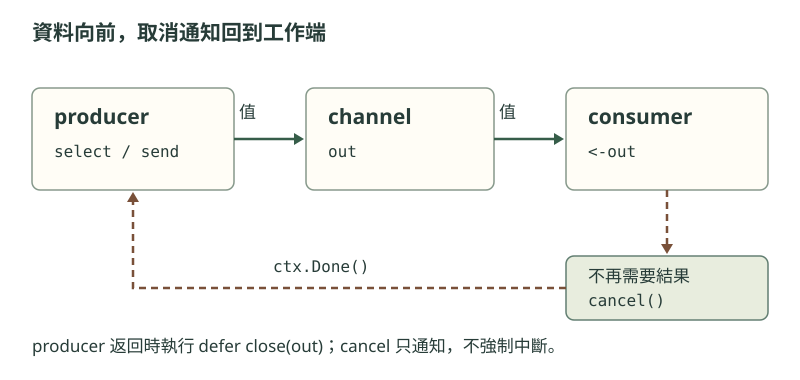

接收者有時只要第一個結果。若它離開後，producer 還卡在下一次發送，工作就無法收尾。

把發送與取消放進同一個 `select`：能交出結果就繼續；收到取消就返回。`ctx.Done()` 是取消通知的 channel。[^context]



```go
package main

import (
	"context"
	"fmt"
	"sync"
)

func squares(ctx context.Context, wg *sync.WaitGroup) <-chan int {
	out := make(chan int)
	wg.Add(1)
	go func() {
		defer wg.Done()
		defer close(out)
		for _, n := range []int{2, 3, 4} {
			select {
			case out <- n * n:
			case <-ctx.Done():
				return
			}
		}
	}()
	return out
}

func main() {
	ctx, cancel := context.WithCancel(context.Background())
	defer cancel()
	var wg sync.WaitGroup
	values := squares(ctx, &wg)

	fmt.Println(<-values)
	cancel()
	wg.Wait()
	fmt.Println("已收尾")
}
```

## cancel 與 Wait 能交換嗎？

`main` 只接收一個值。若先 `wg.Wait()`，等它返回後才 `cancel()`，還能結束嗎？

> [!question]- 查看執行結果
> 不能。producer 的下一次發送沒有接收者，`Wait()` 又在等 producer 返回；取消通知永遠到不了。
>
> 原程式先取消，producer 才能離開等待並執行 `Done()`。輸出是：
>
> ```text
> 4
> 已收尾
> ```
>
> `cancel()` 只通知工作停止；`Wait()` 才等待退出。[^cancel]

[[可以取消的管線#兩個訊號，各管一件事|另一種寫法]]以 `done` 取代 `WaitGroup`，分開取消與完成通知：

![[可以取消的管線#兩個訊號，各管一件事]]

## 取消需要工作配合

如果把 `select` 改回單獨的 `out <- n*n`，取消也救不了卡住的發送。每個可能長時間等待的地方，都要有退出方式；耗時函式也必須接受 context 或自行檢查取消。[[取消與收尾]] 整理了這兩個責任。

`select` 不保證取消優先。若發送和取消同時可進行，仍可能選到發送；本例取消後不再接收，無緩衝的發送無法完成。逾時與多個就緒分支見 [[G06 select 與逾時]]。

[[提早返回的管線]] 只讓接收者離開，上游會停在發送；可取消的版本為這個等待補上退出條件，並由 [[可以取消的管線#^owner|producer 關閉輸出]]。

[^context]: [context.Context.Done](https://pkg.go.dev/context#Context) 與 [Go Blog：Pipelines and cancellation](https://go.dev/blog/pipelines)。
[^cancel]: [context.CancelFunc](https://pkg.go.dev/context#CancelFunc)；分支選擇見 [Go 規格：Select statements](https://go.dev/ref/spec#Select_statements)。
