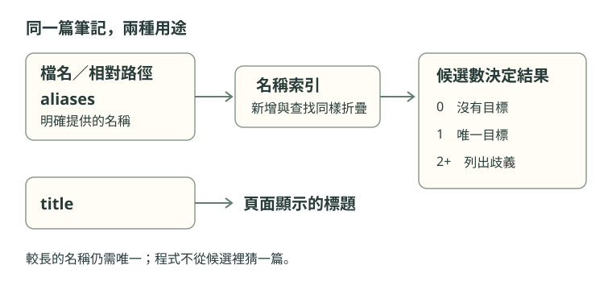

檔名、標題和別名看起來都在替一篇筆記命名。這不代表連結解析會把三者當成相同的入口。

先看一份假想檔案。它只寫在這裡作練習，不是這個書庫中另一篇真的筆記。

```yaml
# 檔案位置：Notes/alpha/Plan.md
title: 下一季的安排
aliases: [工作計畫]
```

## 哪個名稱需要作者補一句話？

假設書庫沒有其他衝突，下列三個目標哪些能找到它？先寫下預測；再讀 [[名稱解析的三種結果#觀察範圍]]，核對自己依賴的是哪條規則。

```text
[[Plan]]
[[工作計畫]]
[[下一季的安排]]
```

> [!question]- 對照宣告再看答案
> 前兩個可以。Plan 是檔名的主幹；工作計畫被明確寫進 aliases。第三個只有標題，沒有被宣告成別名，所以這份輸入不會建立那個查找入口。
>
> 要讓第三個也能使用，可以把它加入 aliases，或改用已存在的名稱。不是文字不夠相似，也不是程式沒看懂中文。
>
> 反例：如果別篇筆記也宣告了工作計畫，第二個目標就不再唯一。宣告建立的是一個名稱，不保證這個名稱只被一個檔案使用。

## 找到規則的主人

[[Frontmatter]] 是資料放的位置；它本身不決定每個欄位被如何使用。這裡需要分開讀兩份依據：

- [[The vault contract|知識庫契約]] 決定這個書庫允許哪些欄位、型別和狀態。
- [[名稱解析的三種結果|名稱解析的實作筆記]] 說明哪些資料被加入名稱索引，以及查找有什麼結果。



圖上的兩條線提醒我們：顯示文字與查找入口各有用途。看見頁面標題，不代表同樣的字能當成連結目標。

這就是 [[宣告與推測]] 的差別。讀技術文件時，先找到誰擁有這條規則，再決定一句概括能說到哪裡。

## 忘了檔名，還能找回依據嗎？

假設隔天只記得「候選數決定結果」，忘了來源的檔名。開啟搜尋，試試這兩次查找：

```text
候選
候選 folder:Notes/reading type:note
```

先看結果的上下文，再打開來源核對。「找到相同的字」只縮小閱讀範圍，還沒有證明你的解釋。來源頁的章節目錄能帶你回到「觀察範圍」。

再加上 `status:draft`，想一想為什麼來源筆記消失，只剩練習稿。移除這個條件後，來源應該回來。**沒有搜尋結果，不等於書庫裡沒有證據**；也可能是自己的條件把它排除了。

想找同一主題的課文，可試 `topic:閱讀 type:lesson`。條件要一起成立；連續寫 `status:draft status:ready` 不代表二選一。

想往下讀 Go 實作，可以從課程支線開啟 [[R06 讀一段 Go 的分支]]。不讀程式也能直接進入下一課的反例練習。
