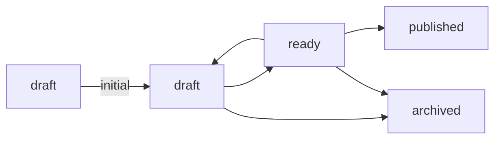

Each `[[lifecycle]]` row in [[The vault contract]] names one status, the note
types it applies to, whether a note may *start* there, and which statuses it
can be reached from.

## initial is written out

A row says outright whether a note can begin at that status. Writing `initial`
on one row means writing it on all of them: a lifecycle where some rows declare
it and the rest leave it to be worked out is refused, because the silent rows
are exactly the ones a reader would have to guess about.

## published is declared and never set

The contract allows `ready → published` and yomihon still refuses to make that
move. The value records a publication that happened somewhere else, and nothing
in a reading surface can attest to one. [[A published note]] carries it, written
by hand, and its status panel offers nothing onward.

## What a write actually is

The button rewrites one frontmatter line. It carries the identity of the bytes
the page showed you: if the note changed on disk in between, the write is
refused rather than applied to a version you never read.
