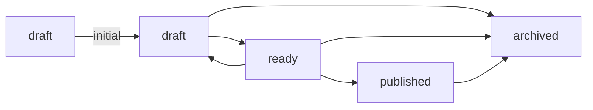

Each `[[lifecycle]]` row in [[The vault contract]] names one status: the note types it applies to, whether a note may start there, and which statuses it can be reached from.

## initial is written out

Every row says whether a note can begin at that status. Writing `initial` on one row means writing it on all of them; a lifecycle that declares it on some rows and leaves the rest open is refused.

## published is declared and never set

The diagram shows transitions the contract allows, including `ready → published`. Yomihon never sets a note **to** `published`, even when the contract permits that target: the value records a publication that happened somewhere else, and a reading surface cannot attest to one.

This restriction concerns the target, not a note already marked `published`. [[A published note]] carries that value, written by hand. Its status panel offers `archived` because this example contract allows `published → archived`, as the diagram shows. Other vaults offer the onward transitions their own contracts permit.

## What a write is

The button rewrites one line of a note's [[Frontmatter]]. If the file changed on disk while you were reading, the write is refused rather than applied to a version you never read.
