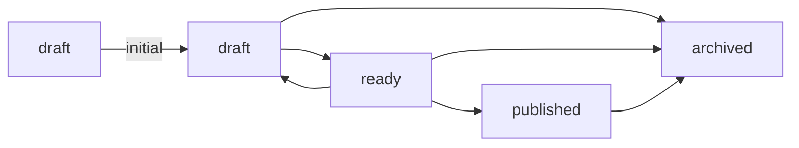

[[知識庫契約]]的每一列 `[[lifecycle]]` 說一個狀態：適用哪些類型、筆記能不能從這裡開始、能從哪些狀態走過來。

## initial 要寫出來

每一列都要說筆記能不能從這個狀態開始。一列寫了 `initial`，其餘各列也得寫；寫一半的生命週期會被拒絕。

## published 宣告得出來，卻不會被設定

上圖呈現契約允許的轉換，包含 `ready → published`。即使契約允許這個目標，yomihon 也不會把筆記**設為** `published`：這個值記錄的是在別處發生的發表，閱讀介面無法為它作證。

這項限制針對的是轉換的目標，不是已經標為 `published` 的筆記。[[A published note]]（英文）手寫上了這個值；它的狀態面板仍提供 `archived`，因為這份範例契約允許 `published → archived`，上圖也畫出了這條路。其他知識庫能提供哪些後續轉換，要看各自的契約。

## 一次寫入是什麼

按鈕改寫 frontmatter 的一行。如果檔案在你讀的這段時間裡被改過，這次寫入會被拒絕，不會套在你沒讀過的版本上。
