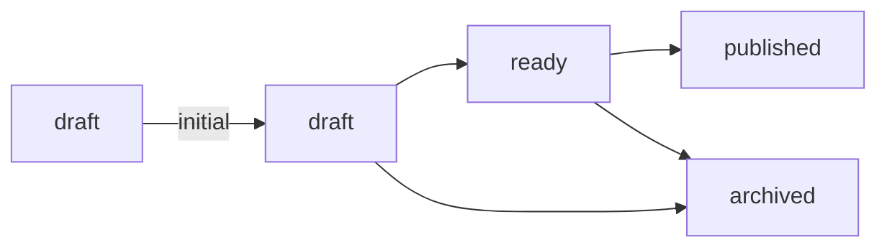

[[知識庫契約]]裡的每一列 `[[lifecycle]]` 說出一個狀態、它適用哪些筆記類型、
一篇筆記可不可以*從*那裡開始，以及它能從哪些狀態走過來。

## initial 一定要寫出來

每一列都直接說明筆記能不能從那個狀態起步。只要有一列寫了 `initial`，其餘各列
就都得寫：一份有些列宣告、其餘列留給人推敲的生命週期會被拒絕，因為沒說話的
那幾列，正好就是讀的人得靠猜的那幾列。

## published 宣告得出來，卻永遠不會被設定

契約允許 `ready → published`，yomihon 仍然拒絕走這一步。這個值記錄的是一場
發生在別處的發表，而閱讀介面上沒有任何東西能為它作證。範例知識庫裡有一篇
用手寫上這個值的筆記，它的狀態面板不提供任何下一步。

## 一次寫入到底是什麼

按鈕改寫的是 frontmatter 的一行。它帶著頁面當初顯示給你的那份內容的識別值：
若筆記在這中間於磁碟上被改過，這次寫入會被拒絕，而不是套用到你從未讀過的
版本。
